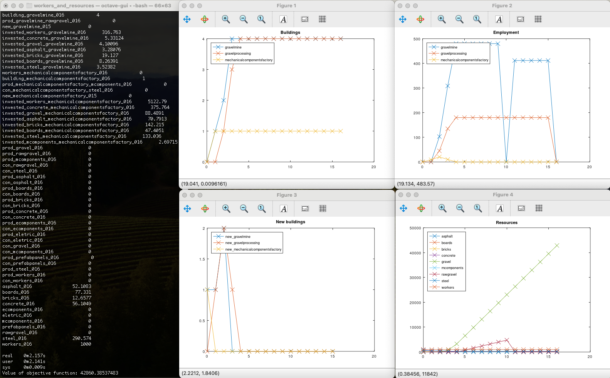

# workers_and_resources

Python parser for building .ini and .bbox files in the game Workers & Resources: Soviet Republic.
Spits out building requirements and technical coefficients.
Also generates `lp_solve` programs based on said coefficients and plots results using GNU Octave.
Can be used for formulating build orders and other planning tasks in the game.
Based on the state of the game in July 2021, may no longer work. Patches welcome!

## Dependencies

### Debian

Probably also works on Ubuntu:

`sudo apt install octave lp-solve`

### macOS

- Octave: `brew install octave`
- lp_solve: `brew install lp_solve`

## License stuff

My code is AGPL.
`cost_resource_auto.txt` and `media_soviet` belong to 3DIVISION.
